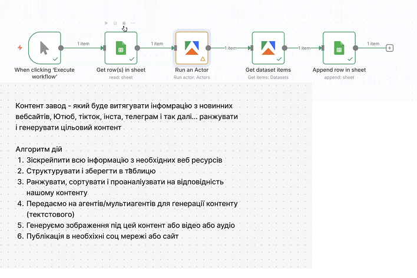

# Content Factory - n8n Workflow

  

## Автор

**Розробник:** Сергій Щербаков
**Email:** sergiyscherbakov@ukr.net
**Telegram:** @s_help_2010

### 💰 Підтримати розробку
Задонатити на каву USDT (BINANCE SMART CHAIN):
**`0xDFD0A23d2FEd7c1ab8A0F9A4a1F8386832B6f95A`**

---

## Опис

Автоматизований n8n workflow для збору контенту з веб-сайтів через Apify та збереження результатів у Google Sheets.

**Що робить workflow:**
1. Читає список URL з Google Sheets
2. Для кожного URL запускає Apify scraper
3. Конвертує HTML у Markdown
4. Зберігає результати назад у Google Sheets

---

## Імпорт workflow

Файл `Урок-11.json` потрібно імпортувати на [n8n.io](https://n8n.io):

1. Увійдіть на n8n.io
2. Workflows → Import from File
3. Виберіть `Урок-11.json`

---

## Структура workflow



Workflow складається з 7 нод:

**Основна гілка (ноди 1-5):**
- Manual Trigger → Google Sheets (читання) → Apify Actor → Apify Dataset → Google Sheets (запис)

**Альтернативна гілка (ноди 6-7):**
- Apify Dataset (прямий доступ) → Google Sheets (запис)

---

# НОДА 1: Manual Trigger

**Назва в workflow:** "When clicking 'Execute workflow'"
**Тип:** Manual Trigger (n8n-nodes-base.manualTrigger)

## Що робить

Стартова точка workflow. Запускається вручну кнопкою "Execute Workflow".

## Налаштування

Немає налаштувань - працює "з коробки".

## Вихідні дані

```json
[
  {
    "json": {}
  }
]
```

Просто порожній об'єкт для запуску наступної ноди.

## Як перевірити

1. Відкрийте workflow в n8n
2. Натисніть "Execute Workflow"
3. Нода стане зеленою
4. У правій панелі: "1 item"

---

# НОДА 2: Google Sheets - Get rows

**Назва в workflow:** "Get row(s) in sheet"
**Тип:** Google Sheets (n8n-nodes-base.googleSheets v4.7)

## Що робить

Читає всі рядки з Google таблиці, де кожен рядок містить URL для парсингу.

## Налаштування

**Document ID:** `18elhWrPQ_v9XgutP4nU23zNrTrOvhRNhgAlgFwkrwiU`
**Sheet Name:** `Лист1`
**Operation:** Read Rows

**Credentials:** Google Sheets OAuth2 API

## Структура вхідної таблиці

Таблиця повинна мати одну колонку:

| Website |
|---------|
| https://example.com |
| https://techcrunch.com |

## Вихідні дані

Для кожного рядка таблиці створюється окремий item:

```json
[
  {
    "json": {
      "Website": "https://example.com"
    }
  },
  {
    "json": {
      "Website": "https://techcrunch.com"
    }
  }
]
```

**Кількість items = кількість рядків у таблиці**

## Як перевірити

1. Створіть тестову Google таблицю
2. Додайте колонку "Website" (A1)
3. Додайте 2-3 URL у рядках нижче
4. У n8n клікніть на ноду
5. Credential → Create New → авторизуйтесь через Google
6. Виберіть вашу таблицю та аркуш
7. Натисніть "Execute node"
8. Перевірте вихід: повинні бути всі URL з таблиці

**Перевірка даних:**
- Вкладка "Table" - таблиця з колонкою Website
- Вкладка "JSON" - масив об'єктів з полем Website

---

# НОДА 3: Apify - Run Actor

**Назва в workflow:** "Run an Actor"
**Тип:** Apify (@apify/n8n-nodes-apify.apify v1)

## Що робить

Запускає Apify Actor "Website Content Crawler" для парсингу веб-сторінки.

**Процес:**
1. Отримує URL з попередньої ноди
2. Запускає браузерний краулер
3. Витягує текстовий контент
4. Видаляє nav, footer, scripts
5. Конвертує у Markdown
6. Зберігає в Apify Dataset

## Налаштування

**Actor ID:** `aYG0l9s7dbB7j3gbS` (Website Content Crawler)
**Memory:** 4096 MB
**Authentication:** Apify OAuth2 API

### Конфігурація Actor

```json
{
  "crawlerType": "playwright:adaptive",
  "blockMedia": true,
  "saveMarkdown": true,
  "removeCookieWarnings": true,
  "expandIframes": true,
  "readableTextCharThreshold": 100,
  "removeElementsCssSelector": "nav, footer, script, style, noscript, svg, img[src^='data:'], [role=\"alert\"], [role=\"banner\"], [role=\"dialog\"]",
  "proxyConfiguration": {
    "useApifyProxy": true
  },
  "startUrls": [
    {
      "url": "{{ $json.Website }}",
      "method": "GET"
    }
  ]
}
```

**Ключові параметри:**

| Параметр | Значення | Опис |
|----------|----------|------|
| crawlerType | playwright:adaptive | Браузерний краулер з JS підтримкою |
| blockMedia | true | Не завантажує зображення/відео |
| saveMarkdown | true | Зберігає результат у Markdown |
| startUrls[].url | {{ $json.Website }} | URL з попередньої ноди |
| removeElementsCssSelector | CSS селектор | Які елементи видалити |

## Вхідні дані

Нода отримує дані з попередньої ноди (Google Sheets):

```json
{
  "Website": "https://example.com"
}
```

**Важливо:** Нода виконується **для кожного item окремо**. Якщо 5 URL → 5 запусків Actor.

## Вихідні дані

```json
{
  "id": "run_abc123",
  "actId": "aYG0l9s7dbB7j3gbS",
  "status": "SUCCEEDED",
  "startedAt": "2024-09-16T12:00:00.000Z",
  "finishedAt": "2024-09-16T12:01:30.000Z",
  "defaultDatasetId": "dataset_xyz789",
  "stats": {
    "netRxBytes": 2458632
  }
}
```

**Найважливіше поле:** `defaultDatasetId` - ID датасету з результатами парсингу.

## Як перевірити

1. Зареєструйтесь на [apify.com](https://apify.com)
2. Скопіюйте API Token: Settings → Integrations
3. У n8n клікніть на ноду
4. Credential → Create New → вставте API Token
5. Відключіть зв'язок з попередньою нодою (видаліть стрілку)
6. У `startUrls[].url` замініть `{{ $json.Website }}` на `https://example.com`
7. Натисніть "Execute node"
8. Зачекайте 30-60 секунд
9. Перевірте вихід - поле `defaultDatasetId` має містити ID датасету

**Перевірка в Apify консолі:**
- Відкрийте [console.apify.com/storage/datasets](https://console.apify.com/storage/datasets)
- Знайдіть датасет з вашим `defaultDatasetId`
- Перегляньте зібрані дані

---

# НОДА 4: Apify - Get Dataset Items

**Назва в workflow:** "Get dataset items"
**Тип:** Apify Datasets (@apify/n8n-nodes-apify.apify v1)

## Що робить

Витягує зібрані дані з Apify Dataset за ID.

## Налаштування

**Resource:** Datasets
**Dataset ID:** `={{ $json.defaultDatasetId }}`
**Limit:** 500
**Authentication:** Apify OAuth2 API

**Параметр `datasetId`:** Динамічно підставляється з попередньої ноди через expression `{{ $json.defaultDatasetId }}`.

## Вхідні дані

Нода отримує `defaultDatasetId` з попередньої ноди:

```json
{
  "defaultDatasetId": "dataset_xyz789",
  "status": "SUCCEEDED"
}
```

## Вихідні дані

Масив зпарсених сторінок:

```json
[
  {
    "url": "https://example.com",
    "crawl": {
      "loadedUrl": "https://example.com",
      "loadedTime": "2024-09-16T12:01:15.000Z",
      "httpStatusCode": 200
    },
    "metadata": {
      "title": "Example Domain",
      "description": "Example domain for documentation",
      "languageCode": "en"
    },
    "text": "# Example Domain\n\nThis domain is for use in illustrative examples in documents...",
    "markdown": "# Example Domain\n\nThis domain is for use in illustrative examples..."
  }
]
```

**Структура даних:**

| Поле | Тип | Опис |
|------|-----|------|
| url | String | Оригінальний URL |
| crawl.loadedUrl | String | Фактичний URL (після редіректів) |
| crawl.loadedTime | DateTime | Час завантаження |
| metadata.title | String | Заголовок сторінки |
| text | String | Контент у Markdown |

## Як перевірити

1. Спочатку виконайте попередню ноду (Run Actor)
2. Скопіюйте `defaultDatasetId` з результату
3. Відключіть зв'язок з попередньою нодою
4. Клікніть на ноду "Get dataset items"
5. Змініть `datasetId` з `={{ $json.defaultDatasetId }}` на конкретне значення: `dataset_xyz789`
6. Натисніть "Execute node"
7. Перевірте вихід - повинно бути поле `text` з Markdown контентом

**Перевірка даних:**
- Вкладка "Table" - таблиця з колонками url, text, metadata
- Вкладка "JSON" - повна структура даних
- Поле `text` має містити контент сторінки у Markdown форматі

---

# НОДА 5: Google Sheets - Append Rows

**Назва в workflow:** "Append row in sheet"
**Тип:** Google Sheets (n8n-nodes-base.googleSheets v4.7)

## Що робить

Додає нові рядки у вихідну Google таблицю з результатами парсингу.

## Налаштування

**Document ID:** `1tlNjUavcyCaNoehcOOdZUqt4ZHjcNjvdF-IYm_VJ0Xk`
**Sheet Name:** `Лист1`
**Operation:** Append
**Credentials:** Google Sheets OAuth2 API

### Mapping колонок

```json
{
  "loadedTime": "={{ $json.crawl.loadedTime }}",
  "loadedUrl": "={{ $json.crawl.loadedUrl }}",
  "text": "={{ $json.text }}"
}
```

## Структура вихідної таблиці

Таблиця повинна мати три колонки:

| loadedTime | loadedUrl | text |
|------------|-----------|------|
| | | |

**Заголовки обов'язкові!** Без них нода не знатиме куди писати дані.

## Вхідні дані

Нода отримує дані з попередньої ноди (Get dataset items):

```json
{
  "crawl": {
    "loadedUrl": "https://example.com",
    "loadedTime": "2024-09-16T12:01:15.000Z"
  },
  "text": "# Example Domain\n\nThis domain is for use..."
}
```

## Вихідні дані

```json
{
  "success": true,
  "spreadsheetId": "1tlNjUavcyCaNoehcOOdZUqt4ZHjcNjvdF-IYm_VJ0Xk",
  "updatedRange": "Лист1!A2:C2",
  "updatedRows": 1
}
```

## Результат у таблиці

| loadedTime | loadedUrl | text |
|------------|-----------|------|
| 2024-09-16T12:01:15.000Z | https://example.com | # Example Domain<br><br>This domain is for use... |

## Як перевірити

1. Створіть тестову Google таблицю
2. Додайте заголовки: A1=`loadedTime`, B1=`loadedUrl`, C1=`text`
3. У n8n клікніть на ноду
4. Виберіть вашу таблицю
5. Перевірте mapping у розділі "Columns":
   - loadedTime = `{{ $json.crawl.loadedTime }}`
   - loadedUrl = `{{ $json.crawl.loadedUrl }}`
   - text = `{{ $json.text }}`
6. Підключіть до попередньої ноди (Get dataset items)
7. Запустіть весь workflow
8. Перевірте таблицю - у рядку 2 повинні з'явитись дані

**Важливо:** Нода виконується для кожного item. Якщо датасет має 3 елементи → додасться 3 рядки.

---

# НОДА 6: Apify - Get Dataset Items (альтернатива)

**Назва в workflow:** "Get dataset items1"
**Тип:** Apify Datasets (@apify/n8n-nodes-apify.apify v1)

## Що робить

Отримує дані з фіксованого Apify Dataset без запуску scraperа.

**Коли використовувати:**
- Датасет вже існує з попереднього запуску
- Потрібно повторно імпортувати ті самі дані
- Тестування без витрат Apify кредитів

## Налаштування

**Resource:** Datasets
**Dataset ID:** `CauuiPzhZfhEKj4FJ` (фіксоване значення)
**Limit:** 500
**Authentication:** Apify OAuth2 API

**Відмінність від ноди 4:** Тут `datasetId` - фіксоване значення, а не динамічне з попередньої ноди.

## Вхідні дані

Немає вхідних даних - нода працює незалежно.

## Вихідні дані

Аналогічно ноді 4 - масив об'єктів з полями:

```json
[
  {
    "url": "...",
    "crawl": {...},
    "text": "..."
  }
]
```

## Як перевірити

1. Відкрийте [console.apify.com/storage/datasets](https://console.apify.com/storage/datasets)
2. Скопіюйте ID будь-якого існуючого датасету
3. У n8n клікніть на ноду
4. Вставте Dataset ID
5. Натисніть "Execute node"
6. Перевірте вихід - дані з датасету

---

# НОДА 7: Google Sheets - Append Rows (альтернатива)

**Назва в workflow:** "Append row in sheet1"
**Тип:** Google Sheets (n8n-nodes-base.googleSheets v4.7)

## Що робить

Ідентична ноді 5 - додає рядки у вихідну таблицю.

## Налаштування

Повністю аналогічні ноді 5:
- Document ID: `1tlNjUavcyCaNoehcOOdZUqt4ZHjcNjvdF-IYm_VJ0Xk`
- Sheet Name: `Лист1`
- Operation: Append
- Mapping: loadedTime, loadedUrl, text

## Як перевірити

Аналогічно ноді 5.

---

# Тестування workflow

## Повний запуск

1. Підготуйте дві таблиці:
   - `cc_input` - колонка Website з 1-2 URL
   - `cc_output` - колонки loadedTime, loadedUrl, text

2. Підключіть credentials:
   - Google Sheets OAuth2
   - Apify OAuth2

3. Запустіть workflow кнопкою "Execute Workflow"

4. Дочекайтесь завершення (всі ноди зелені)

5. Перевірте таблицю `cc_output` - повинні з'явитись результати

**Час виконання:** 30-60 секунд на кожен URL

## Тестування окремих нод

**Нода 2 (Google Sheets Read):**
- Відключіть всі зв'язки
- Execute node
- Перевірте список URL

**Нода 3 (Apify Run):**
- Замініть `{{ $json.Website }}` на `https://example.com`
- Execute node
- Перевірте `defaultDatasetId`

**Нода 4 (Apify Get Dataset):**
- Замініть `={{ $json.defaultDatasetId }}` на конкретний ID
- Execute node
- Перевірте поле `text`

**Нода 5 (Google Sheets Write):**
- Підключіть до ноди 4
- Execute від ноди 4 до ноди 5
- Перевірте таблицю

---

# Вартість

**Apify Free Tier:**
- $5 кредитів/місяць
- 1 запуск ≈ $0.01-0.05
- ~100-500 URL/місяць безкоштовно

**Google Sheets API:**
- Безкоштовно для персонального використання

**n8n Cloud:**
- Starter: $20/міс (2,500 виконань)

---

# Ресурси

- [n8n Documentation](https://docs.n8n.io/)
- [Apify Website Content Crawler](https://apify.com/apify/website-content-crawler)
- [Google Sheets API](https://developers.google.com/sheets/api)
