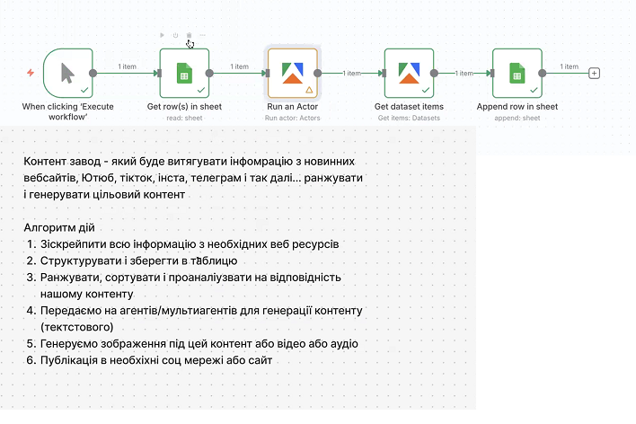

# Content Factory - n8n Workflow для автоматизації збору веб-контенту

---

## 👨‍💻 Автор

**Розробник:** Сергій Щербаков
**Email:** [sergiyscherbakov@ukr.net](mailto:sergiyscherbakov@ukr.net)
**Telegram:** [@s_help_2010](https://t.me/s_help_2010)

### ☕ Підтримати розробку

Якщо цей проєкт допоміг вам зекономити час та автоматизувати збір контенту, ви можете подякувати чашкою кави:

> **💰 Донат на каву:**
>
> **USDT (Binance Smart Chain - BEP20)**
> ```
> 0xDFD0A23d2FEd7c1ab8A0F9A4a1F8386832B6f95A
> ```
>
> Ваша підтримка допомагає створювати більше корисних інструментів! 🙏

---

## 📋 Про проєкт

**Content Factory** — це потужний n8n workflow для автоматизованого збору та структурування контенту з веб-сайтів. Система використовує Apify для інтелектуального веб-скрейпінгу та Google Sheets для зберігання результатів.

### 🎯 Основні можливості

- ✅ Автоматичний збір контенту з будь-яких веб-сайтів
- ✅ Конвертація HTML у чистий Markdown формат
- ✅ Інтеграція з Google Sheets для зручного управління
- ✅ Використання Apify для надійного скрейпінгу
- ✅ Підтримка динамічних JavaScript сайтів
- ✅ Фільтрація непотрібних елементів (реклама, навігація, футери)
- ✅ Batch обробка множини URL одночасно

### 💡 Для чого це потрібно

- 📊 Збір даних для аналізу конкурентів
- 📝 Підготовка контенту для AI-обробки
- 🔍 Моніторинг оновлень на сайтах
- 📚 Створення баз знань для RAG систем
- 🤖 Збір навчальних даних для ML моделей
- 📰 Агрегація новин з різних джерел

---

## 🚀 Швидкий старт

### Крок 1: Імпорт workflow в n8n

> **⚠️ ВАЖЛИВО:** Цей JSON файл потрібно імпортувати у ваш workflow на хмарній платформі [n8n.io](https://n8n.io)

1. Зареєструйтесь або увійдіть на [n8n.io](https://n8n.io)
2. Перейдіть у розділ **Workflows**
3. Натисніть кнопку **"Add workflow"** → **"Import from File"**
4. Виберіть файл **`Урок-11.json`** з цього репозиторію
5. Натисніть **"Import"**
6. Workflow з'явиться у вашому робочому просторі

### Крок 2: Налаштування Google Sheets

#### 2.1 Створення вхідної таблиці (Input)

1. Відкрийте [Google Sheets](https://sheets.google.com)
2. Створіть нову таблицю з назвою **`cc_input`**
3. Додайте заголовок у комірку A1: **`Website`**
4. Заповніть колонку URL-адресами сайтів для парсингу:

| Website |
|---------|
| https://example.com/page1 |
| https://example.com/page2 |
| https://techcrunch.com |

5. Скопіюйте **Document ID** з URL таблиці (це частина URL між `/d/` та `/edit`)

#### 2.2 Створення вихідної таблиці (Output)

1. Створіть ще одну таблицю з назвою **`cc_output`**
2. Додайте заголовки у перший рядок:

| loadedTime | loadedUrl | text |
|------------|-----------|------|
| | | |

3. Скопіюйте **Document ID** цієї таблиці

#### 2.3 Підключення до n8n

1. Відкрийте workflow у n8n
2. Клікніть на ноду **"Get row(s) in sheet"**
3. У полі **"Credential to connect with"** → **"Create New Credential"**
4. Виберіть **"Google Sheets OAuth2 API"**
5. Натисніть **"Sign in with Google"** та авторизуйтесь
6. Вставте **Document ID** вхідної таблиці
7. Виберіть **Sheet Name**: `Лист1`

Повторіть процес для ноди **"Append row in sheet"**, використовуючи Document ID вихідної таблиці.

### Крок 3: Налаштування Apify

#### 3.1 Реєстрація в Apify

1. Перейдіть на [apify.com](https://apify.com)
2. Зареєструйтесь (доступний безкоштовний план з $5 кредитів)
3. Після реєстрації перейдіть у [Settings → Integrations](https://console.apify.com/account/integrations)
4. Скопіюйте ваш **API Token**

#### 3.2 Підключення до n8n

1. У workflow клікніть на ноду **"Run an Actor"**
2. У полі **"Credential to connect with"** → **"Create New Credential"**
3. Виберіть **"Apify OAuth2 API"**
4. Вставте ваш **API Token**
5. Натисніть **"Save"**

Повторіть для нод **"Get dataset items"** та **"Get dataset items1"**.

### Крок 4: Тестовий запуск

1. Додайте кілька URL у вашу вхідну таблицю `cc_input`
2. Поверніться до workflow в n8n
3. Натисніть **"Execute Workflow"** у правому верхньому куті
4. Дочекайтесь завершення виконання (індикатор прогресу на кожній ноді)
5. Перевірте таблицю `cc_output` — там з'являться зпарсені дані

---

## 📊 Архітектура workflow

### Схема роботи

```
┌─────────────────────────────────────────────────────────────┐
│                    ОСНОВНИЙ WORKFLOW                         │
└─────────────────────────────────────────────────────────────┘

[1] Manual Trigger
      ↓
[2] Google Sheets: Get rows (читає URL з cc_input)
      ↓
[3] Apify: Run Actor (запускає Website Content Crawler)
      ↓
[4] Apify: Get dataset items (отримує зібрані дані)
      ↓
[5] Google Sheets: Append rows (зберігає у cc_output)

┌─────────────────────────────────────────────────────────────┐
│                АЛЬТЕРНАТИВНИЙ WORKFLOW                       │
└─────────────────────────────────────────────────────────────┘

[6] Apify: Get dataset items (прямий доступ до існуючого датасету)
      ↓
[7] Google Sheets: Append rows (зберігає у cc_output)
```

### Візуальна схема



---

## 🔧 Технічні деталі

### Використані ноди

| Нода | Тип | Версія | Призначення |
|------|-----|--------|-------------|
| When clicking 'Execute workflow' | Manual Trigger | 1.0 | Ручний запуск |
| Get row(s) in sheet | Google Sheets | 4.7 | Читання вхідних URL |
| Run an Actor | Apify | 1.0 | Запуск веб-краулера |
| Get dataset items | Apify Datasets | 1.0 | Отримання результатів |
| Append row in sheet | Google Sheets | 4.7 | Збереження даних |

### Конфігурація Apify Actor

Workflow використовує [Website Content Crawler](https://apify.com/apify/website-content-crawler) з наступними параметрами:

```json
{
  "crawlerType": "playwright:adaptive",
  "blockMedia": true,
  "saveMarkdown": true,
  "removeCookieWarnings": true,
  "expandIframes": true,
  "memory": 4096,
  "readableTextCharThreshold": 100,
  "removeElementsCssSelector": "nav, footer, script, style, noscript, svg, img[src^='data:'], [role=\"alert\"], [role=\"banner\"], [role=\"dialog\"]",
  "proxyConfiguration": {
    "useApifyProxy": true
  }
}
```

#### Пояснення ключових параметрів:

| Параметр | Значення | Опис |
|----------|----------|------|
| `crawlerType` | `playwright:adaptive` | Використовує Playwright для JS сайтів |
| `blockMedia` | `true` | Не завантажує зображення/відео (економія) |
| `saveMarkdown` | `true` | Зберігає контент у Markdown форматі |
| `removeCookieWarnings` | `true` | Видаляє cookie попередження |
| `memory` | `4096` | Виділяє 4GB RAM для складних сайтів |
| `removeElementsCssSelector` | CSS селектор | Видаляє nav, footer, scripts тощо |

### Структура даних

#### Вхідні дані (cc_input)

```csv
Website
https://techcrunch.com/2024/01/15/ai-news
https://www.theverge.com/2024/1/15/tech-review
https://example.com/blog/post-123
```

#### Вихідні дані (cc_output)

| loadedTime | loadedUrl | text |
|------------|-----------|------|
| 2024-09-16T12:30:45.123Z | https://techcrunch.com/2024/01/15/ai-news | # AI News\n\nLatest developments in artificial intelligence... |
| 2024-09-16T12:31:12.456Z | https://www.theverge.com/2024/1/15/tech-review | # Tech Review\n\nComprehensive review of the latest... |

---

## ⚙️ Налаштування та оптимізація

### Підвищення швидкості парсингу

Якщо сайти прості (без JS), використовуйте Cheerio краулер:

```json
{
  "crawlerType": "cheerio"
}
```

### Обробка JavaScript-heavy сайтів

Для складних Single Page Applications:

```json
{
  "crawlerType": "playwright:adaptive",
  "waitForSelector": ".content-loaded",
  "clientSideMinChangePercentage": 15
}
```

### Економія Apify кредитів

```json
{
  "blockMedia": true,
  "saveScreenshots": false,
  "saveHtml": false,
  "saveFiles": false,
  "memory": 2048
}
```

### Глибоке сканування сайту

```json
{
  "maxCrawlDepth": 3,
  "useSitemaps": true,
  "maxCrawlPages": 100
}
```

### Планування автоматичних запусків

Замініть Manual Trigger на Schedule Trigger:

1. Видаліть ноду **"When clicking 'Execute workflow'"**
2. Додайте ноду **"Schedule Trigger"**
3. Налаштуйте розклад (Cron):
   - Щодня о 9:00: `0 9 * * *`
   - Кожні 6 годин: `0 */6 * * *`
   - Щопонеділка о 8:00: `0 8 * * 1`

### Обробка помилок

Додайте Error Trigger для моніторингу:

1. Додайте ноду **"Error Trigger"**
2. Підключіть до Email або Telegram
3. Налаштуйте повідомлення з деталями помилки

---

## 📝 Приклади використання

### Приклад 1: Моніторинг конкурентів

**Завдання:** Відстежувати нові статті у блозі конкурентів

**Вхідна таблиця:**
```
Website
https://competitor1.com/blog
https://competitor2.com/blog
https://competitor3.com/blog
```

**Результат:** Щоденний збір нового контенту для аналізу стратегії конкурентів

### Приклад 2: Збір новин для AI

**Завдання:** Зібрати новини з різних джерел для генерації власних статей

**Вхідна таблиця:**
```
Website
https://techcrunch.com/category/artificial-intelligence/
https://www.theverge.com/ai-artificial-intelligence
https://venturebeat.com/category/ai/
```

**Результат:** Структурований контент для подальшої обробки AI агентами

### Приклад 3: Створення бази знань

**Завдання:** Зібрати документацію з різних джерел для RAG системи

**Вхідна таблиця:**
```
Website
https://docs.python.org/3/library/
https://docs.djangoproject.com/en/4.2/
https://fastapi.tiangolo.com/
```

**Результат:** Текстова база для векторного індексування та семантичного пошуку

---

## 🛡️ Безпека та best practices

### Захист credentials

- ✅ Використовуйте n8n Credential Manager (credentials ніколи не зберігаються в JSON)
- ✅ Регулярно ротуйте API ключі
- ✅ Обмежуйте доступ до Google Sheets (тільки необхідні таблиці)
- ❌ Ніколи не комітьте API ключі у репозиторій

### Rate limiting

Додайте затримки між запитами для великих batch операцій:

1. Додайте ноду **"Wait"** після кожного запиту
2. Налаштуйте затримку: 1-5 секунд
3. Це допоможе уникнути блокування з боку сайтів

### Дотримання robots.txt

За замовчуванням workflow ігнорує robots.txt:

```json
{
  "respectRobotsTxtFile": false
}
```

Для етичного парсингу встановіть `true`.

---

## 🐛 Troubleshooting

### ❌ Помилка: "Actor run failed"

**Симптоми:** Actor не запускається або падає під час виконання

**Рішення:**
1. Перевірте баланс Apify ([https://console.apify.com](https://console.apify.com))
2. Зменшіть `memory` з 4096 до 2048 MB
3. Перевірте доступність URL (не 404, не блоковано)
4. Спробуйте змінити `crawlerType` на `cheerio`
5. Увімкніть `debugMode: true` для діагностики

### ❌ Помилка: "Failed to get dataset items"

**Симптоми:** Датасет порожній або недоступний

**Рішення:**
1. Переконайтесь, що Actor успішно завершився (зелена галочка)
2. Перевірте `defaultDatasetId` в output попередньої ноди
3. Додайте ноду **"Wait"** на 10-30 секунд між Actor та Get dataset
4. Перевірте права доступу Apify API token

### ❌ Помилка: "Google Sheets: Insufficient permissions"

**Симптоми:** Немає доступу до таблиці

**Рішення:**
1. Повторно авторизуйтесь у Google (OAuth може закінчитись)
2. Перевірте права доступу до таблиці (потрібен Editor)
3. Переконайтесь, що Document ID правильний
4. Спробуйте створити нові credentials

### ❌ Дані не зберігаються в Google Sheets

**Симптоми:** Workflow виконується, але рядки не додаються

**Рішення:**
1. Перевірте execution log (клікніть на ноду після виконання)
2. Переконайтесь, що mapping колонок відповідає структурі таблиці
3. Перевірте, чи headers у таблиці збігаються: `loadedTime`, `loadedUrl`, `text`
4. Спробуйте змінити operation на `appendOrUpdate`

### ❌ Контент витягується неповністю або порожній

**Симптоми:** У таблиці з'являється мало тексту або порожні рядки

**Рішення:**
1. Зменшіть `readableTextCharThreshold` до 50
2. Видаліть або налаштуйте `removeElementsCssSelector` для конкретного сайту
3. Додайте `waitForSelector` для динамічних сайтів
4. Перевірте, чи потрібен `playwright` замість `cheerio`
5. Увімкніть `debugMode: true` та перевірте HTML структуру сайту

---

## 💰 Ціноутворення та ліміти

### Apify

**Free Tier:**
- $5 безкоштовних кредитів щомісяця
- ~500 сторінок парсингу (залежить від складності)
- Максимум 300 секунд на run

**Starter Plan ($49/міс):**
- $49 кредитів щомісяця
- ~5000 сторінок парсингу
- Необмежена тривалість runs

[Детальніше про тарифи Apify](https://apify.com/pricing)

### Google Sheets API

- **Читання:** 300 запитів на хвилину
- **Запис:** 60 запитів на хвилину
- **Безкоштовно** для персонального використання

[Квоти Google Sheets API](https://developers.google.com/sheets/api/limits)

### n8n Cloud

**Starter ($20/міс):**
- 2,500 workflow виконань
- 5 активних workflows

**Pro ($50/міс):**
- 10,000 workflow виконань
- 10 активних workflows

[Тарифи n8n](https://n8n.io/pricing)

---

## 📚 Додаткові ресурси

### Документація

- [Офіційна документація n8n](https://docs.n8n.io/)
- [n8n Community Forum](https://community.n8n.io/)
- [Apify Documentation](https://docs.apify.com/)
- [Website Content Crawler Actor](https://apify.com/apify/website-content-crawler)
- [Google Sheets API Reference](https://developers.google.com/sheets/api/reference/rest)

### Навчальні матеріали

- [n8n Workflows Examples](https://n8n.io/workflows/)
- [Apify Academy](https://docs.apify.com/academy)
- [Web Scraping Best Practices](https://docs.apify.com/academy/web-scraping-for-beginners)

### Корисні інструменти

- [CSS Selector Generator](https://chrome.google.com/webstore/detail/css-selector-generator-fo/)
- [Apify Console](https://console.apify.com/)
- [n8n Cloud Dashboard](https://app.n8n.cloud/)

---

## 🔄 Roadmap та розвиток

Плануються наступні покращення:

- [ ] Автоматичне визначення structure сайту
- [ ] Інтеграція з векторними базами (Pinecone, Weaviate)
- [ ] AI-аналіз зібраного контенту
- [ ] Дедуплікація контенту
- [ ] Sentiment analysis
- [ ] Автоматична генерація тегів та категорій
- [ ] Підтримка multi-language парсингу
- [ ] Експорт у різні формати (JSON, CSV, PDF)

---

## 📄 Ліцензія

Цей проєкт надається "як є" для освітніх та комерційних цілей. Ви вільні використовувати, модифікувати та розповсюджувати його.

---

## 🤝 Контакти та підтримка

### Маєте питання?

- 📧 **Email:** [sergiyscherbakov@ukr.net](mailto:sergiyscherbakov@ukr.net)
- 💬 **Telegram:** [@s_help_2010](https://t.me/s_help_2010)

### Потрібна допомога з налаштуванням?

Я пропоную консультації з:
- ⚙️ Налаштування n8n workflows
- 🤖 Інтеграція AI агентів
- 📊 Автоматизація бізнес-процесів
- 🛠️ Custom розробка workflows

### Знайшли баг або маєте ідею?

Відкрийте Issue у цьому репозиторії або напишіть мені напряму.

---

## 💝 Дякую за використання!

Якщо цей проєкт допоміг вам, буду вдячний за:
- ⭐ Star цього репозиторію
- 📢 Поширення інформації про проєкт
- ☕ Донат на каву (адреса вище)

---

**Зроблено з ❤️ для спільноти automation enthusiasts**

**🇺🇦 Proudly made in Ukraine**
